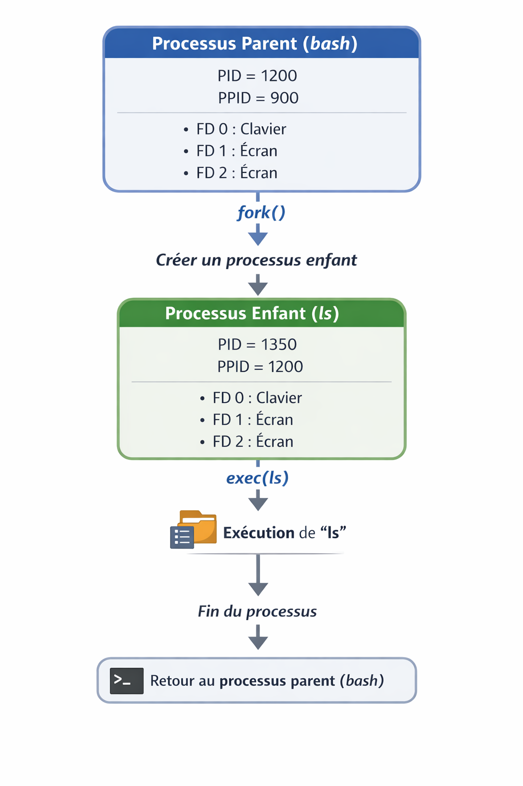

# Table des matières

- [1. Processus et processus parent](#1-processus-et-processus-parent)
  - [1.1 Processus](#11-processus)
  - [1.2 Processus parent](#12-processus-parent)
  - [1.3 Notion d'héritage](#13-notion-dheritage)
- [2. Descripteur de fichier (File discriptors)](#2-descripteur-de-fichier-file-discriptors)
- [3. Deux Types de commands](#3-deux-types-de-commands)
- [4. Les fichiers de configuration](#4-les-fichiers-de-configuration)
- [5. Les variables d'environnement](#5-les-variables-denvironnement)
- [6. Redirections](#6-redirections)
- [7. Controle de taches](#7-controle-de-taches)
- [8. Les Scripts Shell](#8-les-scripts-shell)


# 1. **Processus et processus parent**

## 1.1 Processus

Un **processus** est un programme en cours d’exécution dans le système.  
 Lorsque l’utilisateur lance une application (par exemple bash, ls, firefox), Linux crée un processus qui contient :

* le code du programme,  
* les données en mémoire,  
* un identifiant unique appelé **PID** (*Process ID*).
* un identifiant du processus parent appelé PPID (Parent Process ID).

## 1.2 Processus parent

**Quand un processus lance un autre programme :**

* le nouveau processus devient un processus enfant
* celui qui l’a lancé est le processus parent.

### Commande pour visualiser PID et PPID

```bash
# affiche les processus liés au terminal actuel (le Shell et ses enfants)
# -f (full) : ajoute des colonnes essentielles comme l'UID et surtout le PPID
ps -f
```

## 1.3 Notion d'héritage

Lors de la création d'un enfant, le parent transmet une copie de son environnement :

* Variables exportées (export) : Transmises à l'enfant.
* Variables locales (non exportées) : Non transmises, elles restent inconnues pour l'enfant.

## **Example (execution ls sur Linux)**



Là on a l'excution de la commande externe ls: 

* Le bash courant créer d'abord un processus enfant qui hérite de la processus parent (les variables exportés, et les descripteurs de fichiers).
* La commande `ls` est executé dans le processus enfant.
* `ls` écrit son résultat sur stdout (stdout c'est l'écran).
* Le shell parent attend la fin de l’enfant puis reprend l’exécution.

# 2. **Descripteur de fichier (File discriptors)** 

## 2.1 **C’est quoi un descripteur de fichier ?**

Le descripteur est un numéro (un index) qui pointe vers une ressource. Cette ressource peut être :

* Un fichier réel stocké sur ton disque dur (test.txt).
* Le clavier (ton entrée standard).
* L'écran (ta sortie standard).
* Une connexion réseau (un socket).

Linux lui donne un **numéro** pour travailler avec.

* Ce numéro \= **descripteur de fichier**.

### **Les descripteurs les plus courants:** 

* **Descripteur 0 : Entrée standard (stdin)** – clavier  
* **Descripteur 1 : Sortie standard (stdout)** – écran  
* **Descripteur 2 : Sortie d’erreur standard (stderr)** – messages d’erreur

### **Représentation dans un processus (bash)**


Quand tu ouvres un terminal, ces descripteurs de fichiers sont créés:

Processus (bash)  
 ├─ Table des descripteurs de fichiers  
 │    0 → stdin  
 │    1 → stdout  
 │    2 → stderr

# 3. Deux Types de commands

## 3.1 Commandes internes (builtin)

* Les builtins sont des commandes intégrées au shell Bash lui-même.

**Examples:**

```bash
cd, echo, read, exec, export, alias, pwd, exit
```

> Elles sont exécutées dans le processus bash lui-même et ne créent pas de nouveau processus.

## 3.2 Commandes externes

* les commandes externes sont des programmes indépendants installés sur le système.
* Programmes présents dans /bin, /usr/bin…

**Examples:**

```bash
ls, cat, grep, find, python, rm
```

> Leur exécution crée un sous-processus (processus enfant) du shell.

## 3.3 Comment savoir si une commande est interne ou externe ?

* `type` est la commande officielle.

```bash
type echo # echo is a shell builtin
type bc # bc is hashed (/usr/bin/bc)
```

## 3.4 Example

### Cas commande interne:

```bash
cd /
pwd # affiche dossier courant '/'
```

### Cas commande externe: 

*Cas imaginaire : si cd était une commande externe*
  
```bash
cd /home
/bin/cd /
pwd # affiche dossier courant '/home' pas '/'
```

# 4. Les fichiers de configuration

Il y a 2 situations différentes quand tu utilises Bash :

## 4.1 Login Shell

* Utilisé lors d’une connexion SSH ou au démarrage du système.
* Le fichier chargé est généralement ~/.profile.
* Test : `bash --login`

## 4.2 shell non-login

* Utilisé lors de l’ouverture d’un terminal dans une session déjà connectée.
* Le fichier chargé est ~/.bashrc.
* Test : `bash`

## 4.3 Ordre d'execution

Quand Bash démarre en login shell, il suit cet ordre :

### Cas Login :

* ~/.bash_profile
* (sinon) ~/.bash_login
* (sinon) ~/.profile
* .bashrc est exécuté seulement si l’un des fichiers précédents l’appelle explicitement.

### Cas Non-Login (Interactif) :

* ~/.bashrc uniquement.

# 5. Les variables d'environnement

## 5.1 env

`env` affiche toutes les variables d'environnement.

## 5.2 export

`export` Il met seulement la variable dans l’environnement du shell courant pour qu’elle soit visible par les programmes enfants.

```bash
fullname="toto"
bash
echo $fullname # vide
# ces deux lignes sont équivalent à (executer le code dans un sub-shell - processus enfant)
bash -c 'echo $fullname' # vide


export fullname="toto"
bash -c 'echo $fullname' # affiche toto
```

# 6. Redirections


## 6.1 Rappel STDIN / STDOUT

### Règle importante (ordre d’exécution)

* Dans une commande avec redirections, le shell configure d’abord les redirections d’entrée et de sortie, puis seulement ensuite exécute la commande.

```bash
cat inexistant # cat: inexistant: No such file or directory
cat < inexistant # bash: inexistant: No such file or directory

# le shell ouvre les fichiers avant d’exécuter la commande
# l’erreur vient du shell dans le cas de la redirection
# dans le second cas, cat n’est jamais exécuté.
```

## 6.2 Examples de redirections (De Cours)

```bash
# redirection de la sortie standard vers un fichier
echo "toto" > test.txt
ls > fichier.txt

# 1. redirection de l'entrée standard depuis le fichier toto.txt vers la commande cat
# 2. redirection de la sortie standard de la commande 'cat < toto.txt' vers le fichier FichierSortie
cat < toto.txt >> FichierSortie

# redirection de l'erreur standard vers un fichier
ls abcd 2> erreur.txt

# redirection de l’entrée standard depuis le fichier calcul.txt vers la commande bc
bc < calcul.txt

# 1. redirection de l’entrée standard depuis le fichier calcul.txt vers la commande bc
# 2. redirection de la sortie standard de commande bc vers le fichier resultat.txt
bc < calcul.txt > resultat.txt

# 1. redirection de la sortie standard de la commande ls vers le fichier sortie.txt
# 2. redirection de l'erreur standard vers la sortie standard (sortie.txt)
ls abcc > sortie.txt 2>&1

# transmet la sortie standard de commande `ls -l` vers l’entrée standard de commande `sort`
ls -l | sort -r
```

### Règle simple à retenir

* `>` → pour les fichiers
* `|` → pour les commandes

# 7. Controle de taches

## 7.1 Regroupement

Les parenthèses créent un sous-shell.

```bash
(cd /; ls; pwd); pwd

# dans le sous-shell → on se déplace dans /
# mais le pwd final reste dans l’ancien dossier.
```

Au contraire au:

```bash
cd /; ls; pwd; pwd
#  Ici tout s’exécute dans le shell courant
```

## 7.2 Execution en arrière plan

```bash
(cd /; ls; pwd) & pwd
# le sous-shell (cd /; ls; pwd) est lancé en arrière-plan
# le shell courant exécute immédiatement pwd
```

## 7.3 la commande jobs

La commande `jobs` affiche les commandes executés en arrière plan.

```bash
sleep 10 & # [1] 4321
jobs # [1]+  Running                 sleep 10 &
```

# 8. Les Scripts Shell

## 8.1 Introduction


```bash
#!/bin/bash
# liste
echo "Contenu de répertoire courant"
ls -l
echo "-----------------------------"
```

### Explication des lignes

1. Préciser l’interpréteur utilisé
2. Commentaire
3. Afficher un message
4. Exécution d’une commande
5. Afficher un autre message

## 8.2 Rôle de la ligne #!/bin/bash (shebang)

> Le shebang est utilisé lorsque le script est exécuté comme un programme autonome

Supposons un script test_shebang.sh contient:

```bash
#!/bin/bash
for ((i=0; i<3; i++)); 
    do echo $i; 
done
```

Test:

```bash
./test_shebang.sh # donne permission denied, on doit donne permission d'execution afin d'executer un script autonome

chmod +x test_shebang.sh

# le système lit la première ligne #!/bin/bash et lance automatiquement:
# /bin/bash test_shebang.sh
./test_shebang.sh # affiche le résultat 0, 1, 2

# si on exécute
# bash ignoré, l'interpréteur /bin/sh utilisé
# donne erreur, puisque le syntac (()) n'est pas reconnu par l'interpréteur sh
sh test_shebang.sh
```

**Si le shebang n'est pas specifié, l'interpréteur par default sera utilisé (souvent /bin/sh)**

## 8.3 Deux modes d'execution des scripts

```bash
# creation d'un script test.sh pour afficher le variable $nom
echo 'echo $nom' > test.sh 

# initialisation de variable 'nom'
nom="toto"
echo $nom # affiche "toto"

# Execution dans sous-shell / sous-processus
bash test.sh # affiche rien (subtitution vide)

# Execution sur shell courant
. test.sh # affiche "toto"
source test.sh # meme chose '.' = 'source'
```

## 8.4 Variables et Subtitution de Variables

```bash
fullname="toto"
echo $fullname # subtitution de contenu

fullname=
echo $fullname # subtitution vide
```

## 8.5 Subtitution de commande

* La substitution d’une commande se fait avec \`commande\` ou $(commande).

```bash
echo "répertoire courant est: `pwd`" # répertoire courant est: /home/amranich/SE
echo "répertoire courant est: $(pwd)" # même resultat

# autre example
REPERTOIRE=`pwd`
JESUIS=`whoami`
MACHINE=`hostname`
echo -e "Utilisateur: $JESUIS\n Répertoire de travail: $REPERTOIRE\n Machine: $MACHINE"
```

## 8.6 Les codes de retour (Le statut de sortie)

* Chaque commande en Linux termine avec un nombre entre 0 et 255 :
  
```bash
ls /toto
echo $? # affiche 2 (erreur)

ls /tmp
echo $? # affiche 0 (succès)
```

### Utilité des codes de retour

```bash
# la deuxième commande executé seulment si la 1 ère commande est retourner 0
mkdir dossier_test && cd dossier_test
```

#### Prendre des décisions dans un script

```bash
mkdir dossier
if [ $? -eq 0 ]; then
    echo "Création réussie"
else
    echo "Erreur de création"
fi
```

## 8.7 Neutralisation des caractères spéciaux

* Certains caractères ont une signification spéciale pour Bash: `&`, `(`, `)`, `*`, `!`, `{`, `}`.
* Si on les écrit sans protection, Bash les interprète au lieu de les afficher.

### Exemple du problème

```bash
# il cherche une commande nommée TATA → erreur
echo TOTO & TATA 
```

### Solution avec l'anti-slash 

* Le symbole  neutralise un caractère spéciale est `\`

```bash
echo TOTO \& TATA # affiche 'TOTO & TATA'
```

### anti-slash avec les guillemets

```bash
# guillemets doubles " "
echo "Bonjour \$USER" # Bonjour $USER

# guillemets simples ' '
echo 'Bonjour \$USER' # Bonjour \$USER
```

## 8.8 Les paramètres

```bash
#!/bin/bash
echo "PPID du script:       $$"
echo "Nom de fichier:       $0"
echo "Nombre de paramètres: $#"
echo "Parametre 1:          $1"
echo "Parametre 2:          $2"
echo "Parametre 3:          $3"
echo "ligne de commande:    $@"
echo "ligne de commande:    $*"

# PPID du script:       6349
# Nom de fichier:       parametres.sh
# Nombre de paramètres: 3
# Parametre 1:          11
# Parametre 2:          12
# Parametre 3:          13
# ligne de commande:    11 12 13
# ligne de commande:    11 12 13
```

## 8.9 Lecture et affichage avec `read`

* La commande read permet de lire des données depuis l’entrée standard STDIN (clavier).
* Bash découpe la ligne selon la variable IFS (Internal Field Separator).
* Valeur par défaut : `IFS=$' \t\n'` (Espace, Tabulation, Saut de ligne).

```bash
read nom prenom age # shakir el_amrani 26
echo -e "Nom: $nom\nPrénom: $prenom\nAge: $age"
# Nom: shakir
# Prénom: el amrani
# Age: 26
```

### Example avec IFS est `:`

```bash
IFS=":" read nom prenom age
read nom prenom age # shakir:el amrani:26
echo -e "Nom: $nom\nPrénom: $prenom\nAge: $age" 
# Nom: shakir
# Prénom: el amrani
# Age: 26
```

### L'option `-p`

* L’option `-p` signifie prompt, elle permet d’afficher un message avant la saisie.

```bash
read -p "entrez votre nom, prenom et age: " nom prenom age
```

## 8.10 La commande `shift`

* Supprimer `$1` et décaler tous les paramètres vers la gauche.

```bash
#!/bin/bash
echo "$# : arg1 = $1, arg2 = $2; total : $@"
shift
echo "$# : arg1 = $1, arg2 = $2; total : $@"
shift
echo "$# : arg1 = $1, arg2 = $2; total : $@"
shift
echo "$# : arg1 = $1, arg2 = $2; total : $@"
shift
exit 0
```

Execution de `bash shift.sh 1 2 3` affiche:

```bash
3 : arg1 = 1, arg2 = 2; total : 1 2 3
2 : arg1 = 2, arg2 = 3; total : 2 3
1 : arg1 = 3, arg2 = ; total : 3
0 : arg1 = , arg2 = ; total :
```

## 8.11 Commande de test `[ ]`

### `[]` est équivalent la commande `test`

```bash
test "01" = "1"
echo $? # 1

test 01 -eq 1
echo $? # 0
```

### Pour les opérations arithmétiques :

* `eq`: Equal to
* `ne`: Not equal to
* `lt`: Less than
* `le`: Less than or equal to
* `gt`: Greater than
* `ge`: Greater than or equal to

### Tests de fichiers

* `-e` : Existence globale.
* `-f` : Fichier ordinaire.
* `-d` : Répertoire.
* `-s` : Taille non nulle.
* `-h` : Lien symbolique.
* `-w` : Permission d'écriture pour l'utilisateur courant.
* `-x` : Permission d'execution pour l'utilisateur courant.
* `-r` : Permission de lecture pour l'utilisateur courant.
* `-O` : le fichier appartient à l’utilisateur courant.
* `-G` : le groupe du fichier est celui de l’utilisateur courant.

### `=` vs `-eq` ?

```bash
x="05"

[ "$x" = 5 ] && echo "yes" || echo "no" # no
[ "$x" -eq 5 ] && echo "yes" || echo "no" # yes
```

### Pour quoi espace dans `[ ]` ?

```bash
# [ ... ] est exactement équivalent à : test ...

[ $# -gt 1 ] # test $# -gt 1
```
